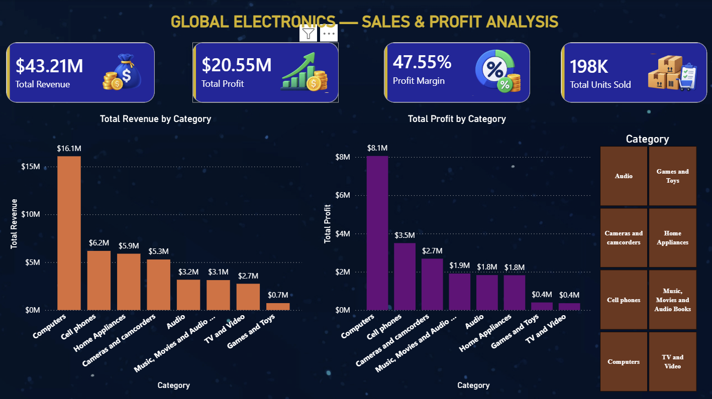

# Global Electronics — SQL & Power BI Sales Analysis

## 📊 Project Overview

This project analyzes sales data from a global electronics retail business using **MySQL and Microsoft Power BI**.

The goal of the project is to identify sales performance, revenue and profitability trends, top-performing products and brands, and category-level business performance.

The project combines **SQL-based data analysis** with an interactive **Power BI dashboard** to transform raw sales data into meaningful business insights.

---

## 🛠️ Tools & Technologies

- **MySQL** — Data analysis and SQL queries
- **Power BI** — Interactive dashboard and data visualization
- **GitHub** — Project documentation and version control

---

## 🗂️ Dataset

The database contains the following tables:

- **Sales** — Transaction-level sales information
- **Products** — Product, brand, category, cost and selling price information
- **Customers** — Customer information
- **Stores** — Store information
- **Exchange Rates** — Currency exchange rate information

---

## 🔍 SQL Analysis

The SQL analysis answers key business questions including:

- Total number of sales transactions
- Number of unique customers
- Number of products sold
- Total units sold
- Top 10 products by quantity
- Top brands by units sold
- Top categories by units sold
- Revenue by category
- Total revenue, cost and profit
- Overall profit margin
- Average quantity per transaction
- Average product selling price
- Top 10 most profitable products
- Top 10 products by revenue
- Profit by brand
- Profit by category
- Product-level profit margin
- Exchange rate analysis
- Overall business summary

The complete SQL queries are available in:

`SQL/SQL/Global_Electronics_Analysis.sql`

---

## 📈 Power BI Dashboard

The Power BI dashboard provides an interactive overview of the company's sales and profitability performance.

### Key Performance Indicators

- **Total Revenue:** $43.21M
- **Total Cost:** $22.66M
- **Total Profit:** $20.55M
- **Profit Margin:** 47.55%
- **Total Units Sold:** 198K
- **Total Transactions:** 63K

### Dashboard Analysis

The dashboard includes visualizations for:

- Revenue by Category
- Profit by Category
- Top 10 Products by Revenue
- Top 10 Products by Profit
- Revenue by Brand
- Profit Margin by Category

---

## 💡 Key Business Insights

### Revenue Performance

**Computers** are the strongest revenue-generating category, contributing approximately **$16.08M** in revenue.

Cell phones and Home Appliances are the next major revenue contributors.

### Profitability

The business generated approximately **$20.55M in total profit**, resulting in an overall profit margin of **47.55%**.

### Category Profitability

Computers generate the highest overall profit among the product categories.

However, some smaller categories demonstrate strong profit margins, showing that revenue volume and profitability are not always directly proportional.

### Product Performance

The top-performing products contribute significantly to overall revenue and profit, highlighting opportunities to focus inventory and marketing efforts on high-performing products.

---

## 📸 Dashboard Preview

### Sales & Profit Analysis



### Product & Brand Analysis


---

## 📁 Project Structure

```text
Global-Electronics-SQL-PowerBI/
│
├── README.md
│
├── SQL/
│   └── SQL/
│       └── Global_Electronics_Analysis.sql
│
├── Global Electronic Retail Dashboard.pbix
│
├── Global-Electronics-Sales & Profit Analysis.png
│
└── Product & Brand Analysis.png

🎯 Business Objective

The main objective of this project is to demonstrate how SQL and Power BI can be used together to analyze business data and support data-driven decision making.

The analysis helps identify:

High-performing product categories
Revenue and profit drivers
Top-performing products and brands
Profitability differences across categories
Overall sales performance

👤 Author

Pranav Rao

MSc Business Analytics — Data Analytics Portfolio Project

⭐ If you found this project useful, feel free to explore the SQL analysis and Power BI dashboard files.
